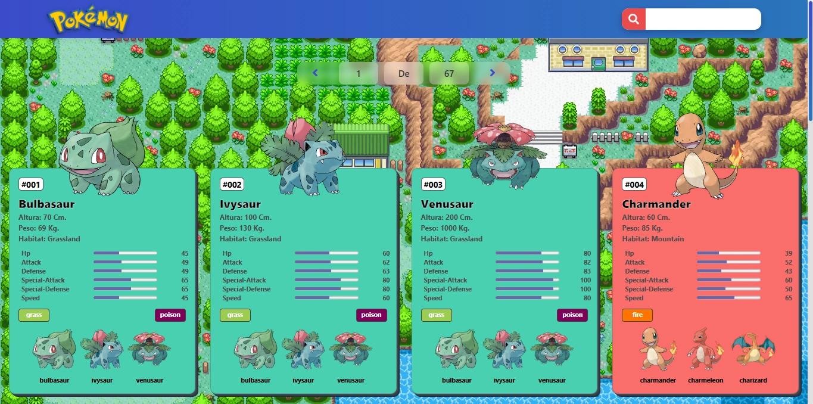
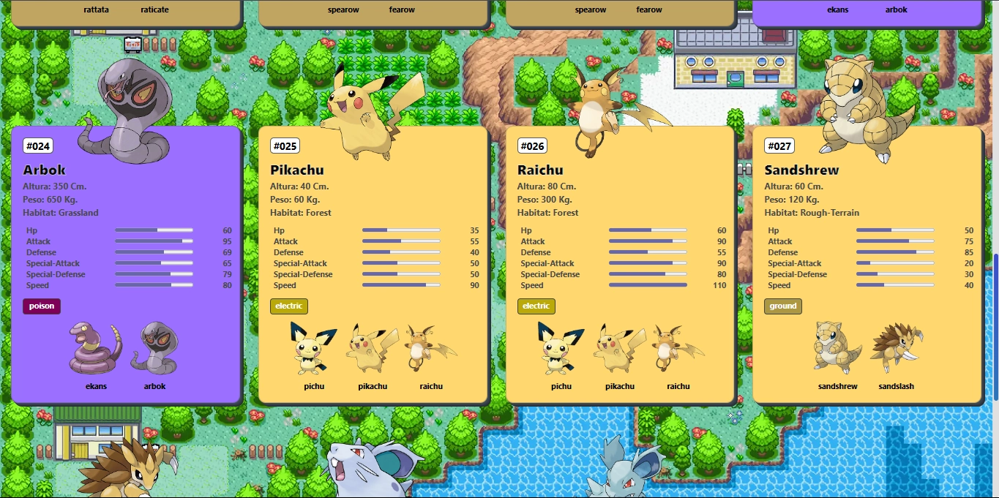
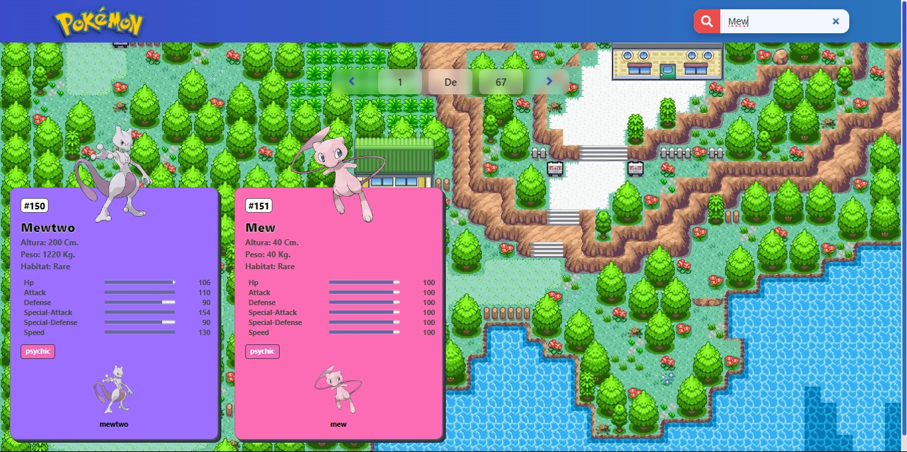

# PokéApi – Pokédex Web Interactiva

Este proyecto es una aplicación web desarrollada con **React** y **Vite**, diseñada para ofrecer una experiencia fluida al explorar información detallada de Pokémon. Utiliza Axios para consumir datos directamente desde la **PokéAPI**, permitiendo consultar hasta los primeros 1000 Pokémon registrados en su base de datos oficial.

<p align="center">
  
</p>

La interfaz está construida con **componentes modulares de React** y gestionada mediante **hooks (useState, useEffect)**, lo que permite un manejo eficiente del estado y del ciclo de vida de los datos. Cada Pokémon se muestra en una tarjeta personalizada según su tipo, que incluye:

- Imagen principal, nombre e ID oficial.

- Altura, peso y tipo(s).

- Estadísticas base (HP, Ataque, Defensa, etc.) representadas con barras de progreso.

- Evoluciones, con efectos visuales al pasar el cursor.

<p align="center">
  
</p>

La app también incorpora un buscador en tiempo real que filtra por nombre y un sistema de paginación dinámica, permitiendo navegar entre más de 67 páginas con 15 Pokémon por vista. El diseño es completamente responsivo, adaptándose a todo tipo de pantallas, desde móviles hasta escritorios.

<p align="center">
  
</p>

**Consulta la versión preliminar del proyecto aquí:** [https://PokeApi–Pokedex.com](https://github.com/AlejandroCisnerosVillegas/Pokedex-react.git)

# 📌 Información del Proyecto

Este proyecto ha sido desarrollado como parte del portafolio de soluciones tecnológicas, con el objetivo de ofrecer una herramienta eficiente y funcional para usuarios autodidactas interesados en la gestión y desarrollo de proyectos web.

- **Área**: Desarrollo de Proyectos Web

- **Usuario Final**: Autodidactas y Desarrolladores

- **Fecha de Desarrollo**: 19 de julio de 2025

- **Portafolio de Proyectos**: [www.alejandrovillegas.dev](https://www.alejandrovillegas.dev)

# 📘 Guía de Instalación y Configuración del Proyecto

Este proyecto fue desarrollado con **React** y empaquetado con **Vite**, utilizando **Yarn** como gestor de dependencias. Se conecta a la **PokéAPI** mediante **Axios** para obtener información dinámica de Pokémon.

---

## 🖥️ Requisitos del Sistema

Para ejecutar este proyecto de forma local, asegúrate de tener instalado:

- **Node.js** (v18 o superior recomendado)
- **Yarn** (v1.22 o superior)  
  👉 Instálalo desde: https://classic.yarnpkg.com/lang/en/docs/install/

---

## 📁 Instalación del Proyecto

1. **Clona este repositorio** o descarga los archivos del proyecto:

```bash
git clone https://github.com/AlejandroCisnerosVillegas/Pokedex-react.git
```

2. **Accede al directorio** del proyecto:

```bash
cd Pokedex-react
```

3. **Instala las dependencias** del proyecto con Yarn:

```bash
yarn install
```

---

## 🔧 Ejecución en Entorno de Desarrollo

Para iniciar el servidor local de desarrollo con **Vite**, ejecuta:

```bash
yarn dev
```

Esto levantará la app en la siguiente URL (por defecto):
👉 http://localhost:5173/

El servidor recargará automáticamente si haces cambios en el código.

---

## ⚙️ Construcción para Producción

Para generar una versión optimizada del proyecto para producción, ejecuta:

```bash
yarn build
```

Esto creará una carpeta **/dist** con todos los archivos listos para ser desplegados.

---

## 📌 Notas Adicionales

- El proyecto es completamente responsivo, compatible con dispositivos **móviles** y de **escritorio**.

- Se recomienda usar un navegador moderno como **Google Chrome** o **Firefox** para mejores resultados.
